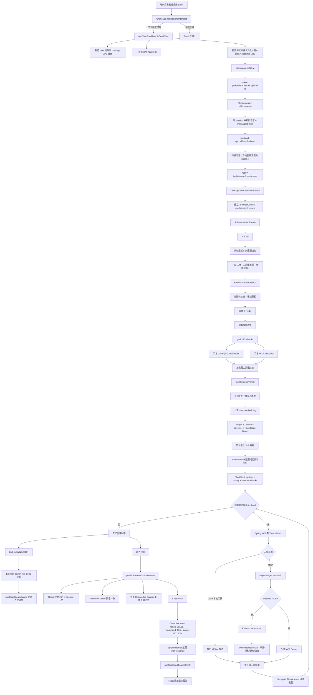
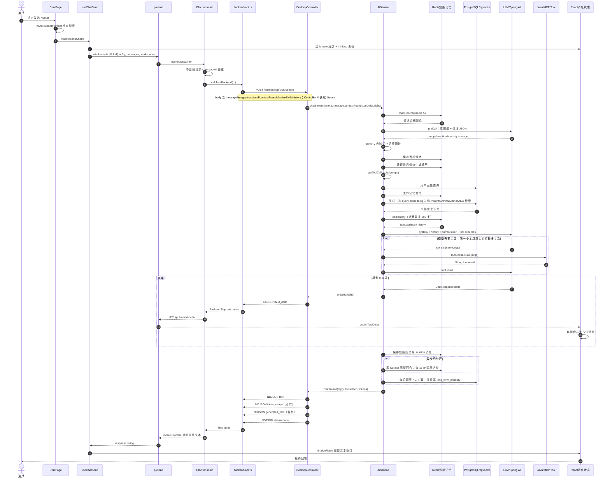
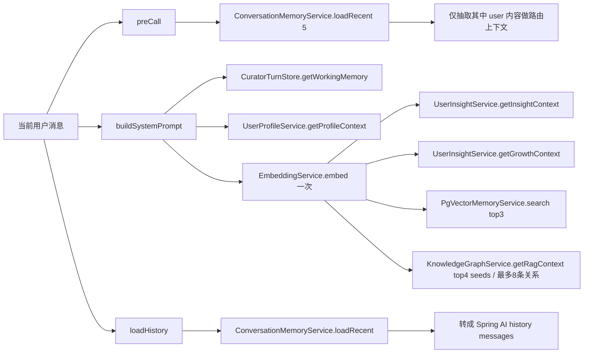
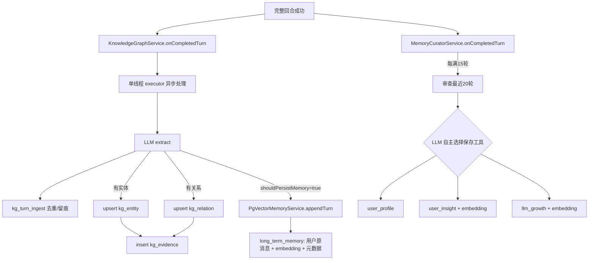
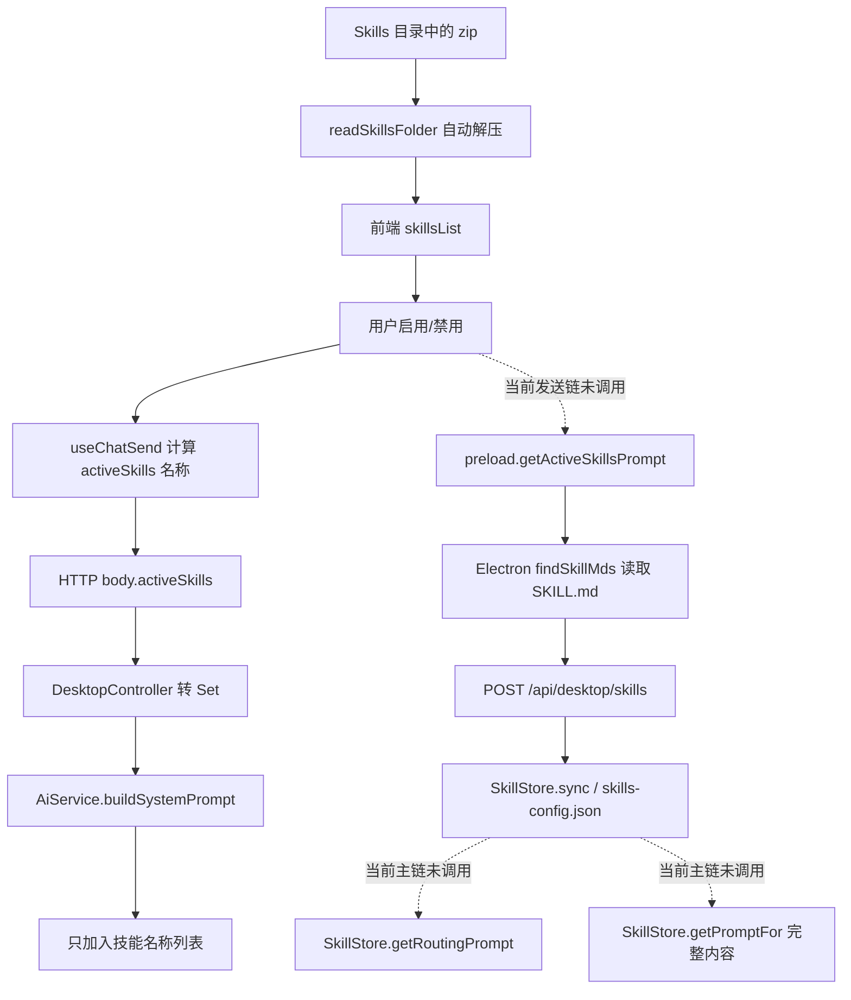
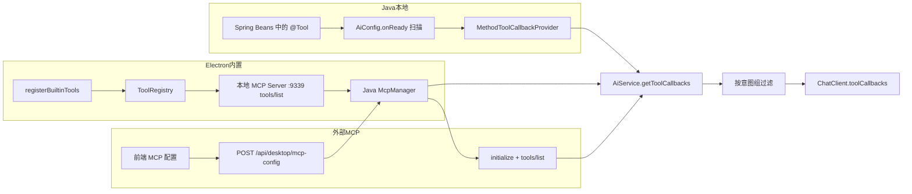
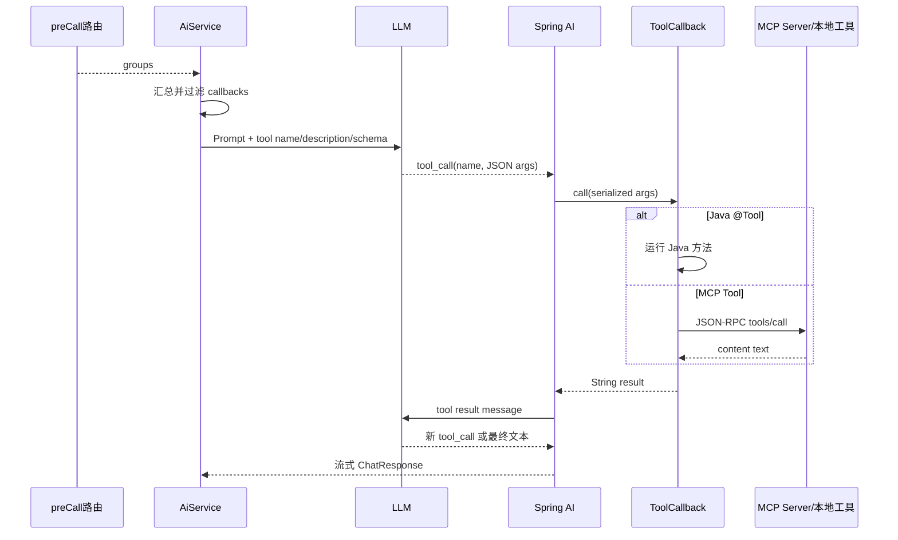

# MindPet Agent 主调用链源码分析

> 分析目标：还原桌面端“一条普通聊天消息从输入到最终回答”的实际调用链。  
> 分析口径：仅以当前仓库源码为依据，不以 README、注释中的规划或理想架构代替实际调用关系。  
> 分析日期：2026-09-12。  
> 变更边界：本次只新增本文档，没有修改任何业务代码。

## 0. 先给结论

普通文本消息的真实主链是：

`ChatPage.handleSendIntercept()` → `useChatSend.handleSendChat()` → preload `window.api.callLLM()` → Electron 主进程 `api:call-llm` → `callLlmInternal()` → `callJavaBackend()` → HTTP `POST /api/desktop/chat/stream` → `DesktopController.chatStream()` → `AiService.chatStream()` → `preCall()` → 情绪后处理 → 短期/长期记忆读取 → `buildSystemPrompt()` → Spring AI `ChatClient` → 可选 Tool 循环 → NDJSON 增量 → Electron IPC 增量 → React 更新占位消息 → NDJSON 最终文本 → Promise 返回 → `finalizeReply()`。

需要特别区分三个概念：

- 前端发送的 `history` **没有被 Java Controller 使用**；主模型实际历史来自 `ConversationMemoryService`。
- Skill 文件内容虽然存在读取、同步和存储代码，但普通聊天主链 **只把 Skill 名称写进 System Prompt，并未写入 SKILL.md 内容**。
- Tool 不是由 Electron 的旧 AgentExecutor 主动循环；当前主链由 Java 把 `ToolCallback` 交给 Spring AI，模型通过 function/tool calling 选择工具，Spring AI 执行并把结果送回模型。

---

## 一、20 个问题的源码结论

| # | 问题 | 当前源码的实际答案 |
|---|---|---|
| 1 | Electron 聊天框发送后先进入哪里？ | 点击发送按钮或按 Enter，先进入 `MindPet/src/renderer/src/pages/ChatPage.tsx` 的 `handleSendIntercept()`；通过上下文额度检查后调用 `handleSendChat()`。真正创建消息和发起请求的是 `MindPet/src/renderer/src/hooks/useChatSend.ts` 的 `handleSendChat()`。 |
| 2 | 请求如何发到 Java？ | `handleSendChat()` 调用 preload 暴露的 `window.api.callLLM()`；preload 通过 `ipcRenderer.invoke('api:call-llm', ...)` 进入 Electron 主进程；主进程 `callLlmInternal()` 调用 `backend-api.ts` 的 `callJavaBackend()`，用 `fetch` 向 `http://127.0.0.1:8080/api/desktop/chat/stream` 发送 JSON，并按 NDJSON 行读取响应。 |
| 3 | 哪个 Controller 接收？ | `MindPet-java/src/main/java/controller/DesktopController.java` 的 `chatStream()`，映射为 `POST /api/desktop/chat/stream`。 |
| 4 | AiService 主调用链？ | `chatStream()` → `preCall()` → `EmotionService.enrich()` → `saveToHistory()` → `getEmotionTrend()` → `getToolCallbacks()` → `ToolCallLimitAdvisor.reset()` → `buildSystemPrompt()` → `loadHistory()` → `ChatClient.prompt().system().messages().user().toolCallbacks()` → `streamResponse()` → 可选工具循环 → `persistStreamedConversation()` → `onCompletedTurn()` → 返回 `ChatResult`。 |
| 5 | 意图识别在哪里？ | `AiService.preCall()`。它读取最近 5 条短期消息中的 user 消息，把工具分组清单和当前消息交给一次轻量 LLM 调用，解析 JSON 的 `groups`。失败时只有图表/绘图关键词的本地兜底。 |
| 6 | 情绪识别在哪里？ | 主链中与意图识别合并在 `AiService.preCall()` 的同一次 LLM 调用中；之后 `EmotionService.enrich()` 执行危险关键词检测与语境翻转。`EmotionService.analyze()` 虽然存在独立 LLM 情绪分析实现，但普通 `chatStream()` 不调用它。 |
| 7 | 短期记忆在哪里读取？ | `preCall()` 用 `ConversationMemoryService.loadRecent(userId, 5)`；主模型由 `AiService.loadHistory()` 再调用 `loadRecent()`。桌面端当前硬编码最多取 200 条消息，传入的 `contextRounds` 只对微信会话生效。 |
| 8 | 长期记忆在哪里检索？ | `AiService.buildSystemPrompt()` 只计算一次 query embedding，然后依次检索 `UserInsightService.getInsightContext()`、`getGrowthContext()`、`PgVectorMemoryService.search(..., 3)` 和 `KnowledgeGraphService.getRagContext(..., 4)`；用户画像由 `UserProfileService.getProfileContext()`直接查 PostgreSQL。 |
| 9 | System Prompt 在哪里组装？ | `AiService.buildSystemPrompt()`。顺序是：当前时间 → 动态或默认基础 Prompt → 固定身份 Prompt → Redis 工作记忆 → 情绪 → 情绪趋势 → 用户画像 → Insight RAG → LLM Growth RAG → pgvector 长期记忆 → 知识图谱 → 活跃 Skill 名称。若路由命中工具，`chatStream()` 还会在最前面加“必须调用工具”的系统指令。 |
| 10 | Skill 在哪里读取、加入 Prompt？ | Electron 主进程 `findSkillMds()` 与 `api:get-active-skills-prompt` handler 能从解压目录读取 `SKILL.md`，并可 POST 到 `/api/desktop/skills`；Java `SkillStore` 能加载/保存内容。但发送主链没有调用 `getActiveSkillsPrompt()`，`AiService` 也没有调用 `SkillStore.getPromptFor()`，所以当前只在 `buildSystemPrompt()` 注入前端传来的 Skill 名称，**内容未生效**。 |
| 11 | Tool 在哪里注册给 LLM？ | Java 本地工具：`AiConfig.onReady()` 扫描 Spring Bean 的 `@Tool` 方法，构造成 `ToolCallback`。Electron 内置工具：`registerBuiltinTools()` 注册进 `ToolRegistry`，`mcp-server.ts` 通过本地 MCP 暴露；Java `McpManager.syncServers()` 执行 `initialize`、`tools/list` 并构造 MCP `ToolCallback`。每次聊天由 `AiService.getToolCallbacks()` 汇总、过滤，最终 `.toolCallbacks(callbacks)` 注册到本次 LLM 请求。 |
| 12 | LLM 如何决定调用 Tool？ | `preCall()` 先选择工具组，`getToolCallbacks()` 只把匹配的 Java/桌面工具（以及当前实现中所有非桌面 MCP 工具）交给模型。模型看到每个 callback 的名称、description 和 JSON input schema；路由命中且 callback 非空时，System Prompt 还明确要求必须调用工具。最终是否发出 tool call 由模型的原生 tool/function calling 决定。 |
| 13 | Tool 结果如何回到 LLM？ | Spring AI 接收到模型的 tool call 后调用对应 `ToolCallback.call(input)`；Java工具直接运行 `@Tool` 方法，MCP 工具则由 `McpManager.callTool()` 发 `tools/call`。callback 返回字符串后，Spring AI 将其作为工具结果加入后续模型请求，模型据此继续调用工具或生成文字。`AiService` 没有手写这段回送循环。 |
| 14 | 工具最多循环多少次？ | 当前项目能确定的是：**同一个工具在一次流式请求中最多真正执行 2 次**，由 `AiService.getToolCallbacks()` 的 wrapper 强制；`ToolCallLimitAdvisor` 也设定 `MAX_PER_TOOL = 2`。项目没有配置“整个请求最多 N 轮”或“所有工具总共 N 次”的全局上限，因此不能从本项目源码得出一个固定总循环数；理论总实际执行数取决于本次暴露的不同工具数，每个至多 2 次。第三次及以后会返回限流文本而不再执行真实工具。 |
| 15 | 最终回答怎么回 Electron？ | Java 先持续输出 `text_delta` NDJSON；Electron 主进程把它们转成 `api:llm-text-delta` IPC，`useChatStreamEvents()` 按 animation frame 合并进思考中消息。Java 完成后输出 `text` 事件；`callLlmInternal()` 保存为 `finalResponse` 并作为 IPC invoke 的 Promise 结果返回；`useChatSend()` 调用 `finalizeReply()`，用完整文本替换占位消息并结束 thinking 状态。 |
| 16 | 对话结束后写入 Redis 什么？ | 成功完成时：`chat:history:{userId}:{sessionId}` 写用户与助手两条短期消息；`session:msgs:{userId}:{sessionId}` 写两条可展示的结构化消息，`session:list:{userId}` 更新时间；`curator:turns:{userId}` 写一个完整回合并递增计数。情绪在主调用前半段已写 `emotion:history:{userId}:{sessionId}`。每 15 轮馆长任务还会写 checkpoint、工作记忆和运行记录等键。 |
| 17 | PostgreSQL 长期记忆写什么？ | 每个成功回合都会异步运行知识抽取：至少写 `kg_turn_ingest`；有实体/关系时写或更新 `kg_entity`、`kg_relation`、`kg_evidence`。仅当抽取结果 `shouldPersistMemory()` 为真时，才将**用户原消息**及 embedding、importance、confidence、emotion、event time 等写入 `long_term_memory`。每 15 轮的 Memory Curator 还可能写 `user_profile`、`user_insight`、`llm_growth`，这些也是长期个性化数据，但不是 `long_term_memory` 表。 |
| 18 | MemoryCuratorService 何时触发？ | 每个成功并已持久化的完整 user/assistant 回合都会调用 `MemoryCuratorService.onCompletedTurn()` 并写入馆长回合队列；当“累计完成回合数 - checkpoint ≥ 15”时获取 Redis 锁并异步执行，按批次每 15 轮触发一次，每次审查目标位置之前最近 20 个完整回合。失败不推进 checkpoint，可由后续触发或 retry 重试。 |
| 19 | 知识图谱何时更新？ | 每个成功完整回合都会调用 `KnowledgeGraphService.onCompletedTurn()`；它按 turn hash 去重后提交到单线程 `knowledgeGraphExecutor`，异步调用 LLM 抽取并写 PostgreSQL。回答返回给 Electron 不等待图谱更新完成。另有 `/api/desktop/knowledge-graph/rebuild` 可从历史会话显式重建。 |
| 20 | Token 统计在哪里？ | `preCall()` 从前置 LLM `ChatResponse.metadata.usage` 取 token；`streamResponse()` 从流中 usage 取主调用 token，并用流中见到的最大值；`chatStream()` 合并两者进 `ChatResult`；Controller 输出 `token_usage` NDJSON；Electron 转成 `api:llm-token-usage`，`useTokenUsageRuntime()` 最多保留 1000 条到 `localStorage`。若后端没有主调用 usage，Electron 用字符数 `/ 2.5` 估算。 |

---

## 二、完整流程图

### 关键边界

- 上图描述 `mode = chat` 的普通文本主链。
- 有图片时 Controller 只解码 `images.get(0)`，随后进入 `AiService.chatWithImageStream()`；其记忆、Prompt、Tool、持久化结构与文本流式链基本相同。
- `mode = summary` 直接调用 `AiService.chatSimple()`，不走意图、情绪、记忆、Skill 或 Tool 主链。

---

## 三、涉及的关键文件

### 3.1 React 渲染进程

| 文件 | 主链角色 |
|---|---|
| `MindPet/src/renderer/src/pages/ChatPage.tsx` | 输入框、Enter/发送按钮入口；`handleSendIntercept()` 做上下文额度拦截。 |
| `MindPet/src/renderer/src/hooks/useChatController.ts` | 把页面的 `handleSendChat` 等动作代理到 App Store 实际实现。 |
| `MindPet/src/renderer/src/hooks/useAppStore.ts` | 组装 chat send、reply、stream、summary、token runtime，并维护会话状态。 |
| `MindPet/src/renderer/src/hooks/useChatSend.ts` | 创建用户消息与占位消息、处理附件、选取 Skill 名称、调用 Electron LLM API。 |
| `MindPet/src/renderer/src/hooks/useChatStreamEvents.ts` | 订阅并批量合并 `text_delta` IPC，实时更新 thinking 消息。 |
| `MindPet/src/renderer/src/hooks/useChatReplyRuntime.ts` | `finalizeReply()` 用完整回答收口；`failReply()` 和 `abortReply()` 处理失败与中断。 |
| `MindPet/src/renderer/src/hooks/useTokenUsageRuntime.ts` | 批量接收 Token 事件并写入 `localStorage`。 |

### 3.2 Electron preload 与主进程

| 文件 | 主链角色 |
|---|---|
| `MindPet/src/preload/index.ts` | 安全暴露 `callLLM`、`onLlmTextDelta`、`onTokenUsage`、`onToolEvent` 等 IPC 能力。 |
| `MindPet/src/main/index.ts` | 注册 IPC handler；`callLlmInternal()` 处理去重、中断、NDJSON 事件转发、Token 兜底估算和最终 Promise；启动桌面 MCP Server；读取 Skill 包。 |
| `MindPet/src/main/backend-api.ts` | 将消息转换为 Java 请求、把图片读为 base64、POST 流式接口、逐行解析 NDJSON。 |

### 3.3 Java HTTP 与 LLM 主链

| 文件 | 主链角色 |
|---|---|
| `MindPet-java/src/main/java/controller/DesktopController.java` | `/chat/stream` 入口；设置请求上下文、选择文本/图片/摘要方法、输出 NDJSON；还提供 LLM/MCP/Skill 配置同步接口。 |
| `MindPet-java/src/main/java/service/AiService.java` | Agent 总编排：前置路由与情绪、工具筛选、记忆读取、Prompt 组装、模型流、持久化。 |
| `MindPet-java/src/main/java/service/DynamicChatClientFactory.java` | 根据静态或动态配置构造/缓存 OpenAI-compatible `ChatClient`。 |
| `MindPet-java/src/main/java/config/DynamicLlmConfig.java` | 保存并提供前端同步的 API Key、Base URL、模型和自定义 System Prompt。 |
| `MindPet-java/src/main/java/model/ChatResult.java` | 封装最终回答、是否使用工具、prompt/completion token。 |

### 3.4 Memory / PostgreSQL / pgvector

| 文件 | 主链角色 |
|---|---|
| `MindPet-java/src/main/java/service/ConversationMemoryService.java` | Redis 短期上下文；7 天 TTL、每会话最多 200 条；Redis 不启用/失败时退回 JVM 内存。 |
| `MindPet-java/src/main/java/service/SessionService.java` | Redis 中的桌面会话与完整消息归档；每会话最多 200 条、不设 TTL。 |
| `MindPet-java/src/main/java/controller/SessionController.java` | Electron 获取/创建/更新会话和消息的 HTTP API。 |
| `MindPet-java/src/main/java/service/EmotionService.java` | 情绪危险词、语境翻转、情绪历史 Redis 与趋势生成。 |
| `MindPet-java/src/main/java/service/EmbeddingService.java` | 为当前 query、长期记忆、Insight、Growth、KG 实体生成向量。 |
| `MindPet-java/src/main/java/service/PgVectorMemoryService.java` | 写 `long_term_memory`；语义 + 关键词召回、RRF/衰减/重要性重排、访问刷新和清理。 |
| `MindPet-java/src/main/java/service/UserProfileService.java` | 读写 `user_profile`，完整画像直接注入 Prompt。 |
| `MindPet-java/src/main/java/service/UserInsightService.java` | 读写 `user_insight` 与 `llm_growth`，按向量相关性注入 Prompt。 |
| `MindPet-java/src/main/java/service/CuratorTurnStore.java` | Redis 馆长回合队列、计数、checkpoint、锁、工作记忆和运行记录。 |
| `MindPet-java/src/main/java/service/MemoryCuratorService.java` | 每 15 个完整回合审查最近 20 轮，以三个专用工具提炼长期个性化记忆。 |
| `MindPet-java/src/main/java/service/KnowledgeGraphService.java` | 每个完整回合异步抽取实体、关系、证据，并决定是否写 pgvector 长期记忆。 |
| `MindPet-java/src/main/java/controller/KnowledgeGraphController.java` | 图谱查询、证据、删除和显式重建 API。 |
| `MindPet-java/sql/migration_v3.sql` | 长期记忆增加 `session_id`。 |
| `MindPet-java/sql/migration_v4_knowledge_graph.sql` | `kg_entity`、`kg_relation`、`kg_evidence`、`kg_turn_ingest` 表。 |
| `MindPet-java/sql/migration_v5_knowledge_graph_fading.sql` | 图谱软遗忘索引。 |
| `MindPet-java/sql/migration_v6_unified_memory_importance.sql` | 长期记忆 importance/confidence 等元数据。 |
| `MindPet-java/sql/migration_v7_temporal_memory.sql` | 长期记忆事件时间字段。 |

### 3.5 Skill

| 文件 | 主链角色 |
|---|---|
| `MindPet/src/main/index.ts` 中 `readSkillsFolder()` / `findSkillMds()` / `api:get-active-skills-prompt` | 枚举 ZIP、解压、递归读取 `SKILL.md`，并可同步给 Java。 |
| `MindPet/src/preload/index.ts` 中 `getActiveSkillsPrompt()` | 暴露 Skill 内容读取 IPC；当前发送主链没有调用。 |
| `MindPet-java/src/main/java/controller/DesktopController.java` 中 `syncSkills()` | 接收 `POST /api/desktop/skills`。 |
| `MindPet-java/src/main/java/config/SkillStore.java` | 存储/持久化 Skill 内容，能产生路由摘要或完整 Prompt；这些生成方法当前没有接入聊天主链。 |

### 3.6 Tool / MCP / RPA / Office

| 文件或目录 | 主链角色 |
|---|---|
| `MindPet-java/src/main/java/config/AiConfig.java` | Spring 启动完成后扫描全部 `@Tool` 方法并缓存 callback provider；配置日志与限流 advisor。 |
| `MindPet-java/src/main/java/config/ToolCallLimitAdvisor.java` | 按工具名统计调用并在达到 2 次后移除该工具。 |
| `MindPet-java/src/main/java/service/McpManager.java` | MCP initialize、tools/list、tools/call；将 MCP 工具包装成 Spring AI callback。 |
| `MindPet-java/src/main/java/tool/ToolUserContext.java` | 保存 user/session/request/image、工具使用状态和 Java 侧生成文件，在线程切换时由 callback wrapper 恢复。 |
| `MindPet-java/src/main/java/tool/impl/*.java` | Java 本地业务工具实现；当前仓库有天气、语音、翻译、计算、出行、外卖、邮件、发票、动漫、图表等 `@Tool`。 |
| `MindPet/src/main/tools/builtin/index.ts` | 注册 Electron 内置 terminal/file/search/web/office/office-skill/system/computer/rpa 工具。 |
| `MindPet/src/main/tools/core/tool-registry.ts` | 保存工具 manifest 与 executor，提供 schema 目录。 |
| `MindPet/src/main/tools/core/tool-executor.ts` | Electron 统一执行器：安全审计、授权弹窗、超时、中断、内置/外部 MCP 执行。 |
| `MindPet/src/main/tools/mcp/mcp-server.ts` | 在 `127.0.0.1:9339` 将 Electron 内置工具暴露为 MCP。 |
| `MindPet/src/main/tools/mcp/mcp-manager.ts` | Electron 侧外部 MCP 配置与直接执行能力；当前 Java 主链主要通过 Java `McpManager` 调用 MCP。 |
| `MindPet/src/main/tools/security/audit-pipeline.ts` | 工具执行前风险审计。 |
| `MindPet/src/main/tools/security/permission-manager.ts` | 需要时向用户请求执行许可。 |
| `MindPet/src/main/tools/builtin/rpa/manifest.ts` / `executor.ts` / `workflow-utils.ts` | RPA 工具 schema、工作流查找和执行。 |
| `MindPet/src/main/tools/builtin/office/manifest.ts` / `executor.ts` | 基础 Office 文件生成、修改、预览入口。 |
| `MindPet/src/main/tools/builtin/office/skills/*` | DOCX/XLSX/PPTX/PDF 的结构化 Office Skill 与转换执行。 |

---

## 四、关键函数职责

### 4.1 前端与 Electron

| 函数 | 职责与数据变化 |
|---|---|
| `ChatPage.handleSendIntercept()` | 检查“当前上下文估算 + 草稿估算”是否超过 context window；通过后调用发送动作。 |
| `useChatSend.handleSendChat()` | 读取当前会话；判断是否为 steering；创建 user 与 thinking placeholder；处理附件；取全部未禁用 Skill 名称；选取前端 `contextRounds * 2` 条消息；调用 `window.api.callLLM()`；成功后 finalize。 |
| `toLlmMessage()` | 将界面消息转成 `{role, content}`；文件文字直接拼入文本；图片转为 `local-file:///` image block。 |
| preload `callLLM()` | 将参数通过 `api:call-llm` IPC invoke 交给主进程。 |
| `callLlmInternal()` | 同 session 新请求中断旧请求、同 messageId 去重；消费 Java NDJSON；转发增量/Token/文件事件；返回最终文本。 |
| `callJavaBackend()` | 固定 `userId = desktop-user`；将最后一条消息作为 `message`、之前消息作为 `history`；POST Java；解析每一行 NDJSON。 |
| `useChatStreamEvents()` | 每帧批量把增量追加到对应 session/messageId 的 thinking 消息，避免每个 token 都触发一次 React 更新。 |
| `finalizeReply()` | 用服务端完整文本替换已累积的增量文本，取消 thinking，发桌面通知并触发会话摘要。 |
| `useTokenUsageRuntime()` | 每 200ms 批量落入状态，每 1 秒最多持久化一次，保留最后 1000 条。 |

### 4.2 Java 主链

| 函数 | 职责与数据变化 |
|---|---|
| `DesktopController.chatStream()` | 解析 body；设置 `ToolUserContext`；选择 summary/image/text 分支；把 delta、最终文本、Token、生成文件写为 NDJSON；结束时清理上下文。 |
| `AiService.chatStream()` | 完成一次流式 Agent 回合的总编排。 |
| `AiService.preCall()` | 用一次 LLM 同时输出工具分组和原始情绪；上下文只取最近 5 条中的 user 消息。返回的 `skills` 字段当前始终为空。 |
| `EmotionService.enrich()` | 不再调用 LLM；优先做危险词检测，再用规则修正 preCall 情绪。 |
| `EmotionService.saveToHistory()` | 将 emotion/intensity/triggers/timestamp 写 Redis，最多 50 条、TTL 7 天。 |
| `EmotionService.getEmotionTrend()` | 读取情绪列表最后一条与 current 比较，生成趋势文本。当前调用顺序存在问题，见问题清单。 |
| `AiService.getToolCallbacks()` | 从全部 `ToolCallbackProvider` 汇总工具；按意图组过滤；包裹用户上下文、使用标记、日志和每工具 2 次限制。 |
| `AiService.buildSystemPrompt()` | 汇总身份、时间、记忆、情绪、画像、四类 RAG 和 Skill 名称。 |
| `AiService.loadHistory()` | 把短期记忆中的 `role/content` 转为 Spring AI `UserMessage`/`AssistantMessage`。 |
| `AiService.streamResponse()` | 订阅 `chatSpec.stream().chatResponse()`；更新 usage；把文本增量交给 Controller；阻塞到流结束。 |
| `AiService.persistStreamedConversation()` | 同时写短期对话 Redis 与 Session Redis，再触发馆长和知识图谱异步后处理。 |
| `AiService.onCompletedTurn()` | 分叉到 `MemoryCuratorService` 与 `KnowledgeGraphService`。 |
| `DynamicChatClientFactory.build()` | 静态配置时使用 Spring 注入 builder；动态配置时创建并缓存 OpenAI-compatible API/model/client。 |

### 4.3 Memory

| 函数 | 职责 |
|---|---|
| `ConversationMemoryService.loadRecent()` | 从当前 `ToolUserContext.sessionId` 对应 Redis List 取末尾 N 条；不可用时退回 JVM 内存。 |
| `ConversationMemoryService.append()` | 追加 JSON 消息、裁剪到 200 条、刷新 7 天 TTL。 |
| `SessionService.appendMessage()` | 以 message id 更新或追加会话消息，裁剪到 200 条，并更新 session zset 时间；不设 TTL。 |
| `EmbeddingService.embed()` | 将查询或记忆文本转为 pgvector 使用的向量。 |
| `PgVectorMemoryService.search()` | 语义召回 20 + 关键词召回 20 → RRF → 时间、重要性、置信度等重排 → topK；命中后刷新访问计数和时间。 |
| `PgVectorMemoryService.appendTurn()` | 当前知识抽取判断值得记忆时，只保存 user 内容及记忆元数据。 |
| `MemoryCuratorService.onCompletedTurn()` | 每轮写馆长队列；达到 15 轮间隔时异步调度。 |
| `MemoryCuratorService.processDueBatches()` | 按 checkpoint 每 15 轮处理一个批次；成功推进 checkpoint，失败留待重试。 |
| `MemoryCuratorService.curate()` | 审查最近 20 回合和已有记忆，让 LLM 自主调用三种保存工具，并更新 Redis 工作记忆。 |
| `KnowledgeGraphService.onCompletedTurn()` | 每轮按 hash 去重并异步提交抽取。 |
| `KnowledgeGraphService.extract()` | LLM 输出是否值得记忆、importance/confidence、实体和关系。 |
| `KnowledgeGraphService.persist()` | upsert 实体/关系、写证据与 ingest 标记。 |
| `KnowledgeGraphService.getRagContext()` | query/entity 显式或向量命中作为种子，再扩一跳关系，输出最多 8 条高置信事实。 |

### 4.4 Skill 与 Tool

| 函数 | 职责 |
|---|---|
| `findSkillMds()` | 最深 4 层递归寻找大小写不敏感的 `skill.md`。 |
| `api:get-active-skills-prompt` handler | 读取启用 Skill 内容、拼出 prompt，并异步同步到 Java；当前主发送链未调用。 |
| `SkillStore.sync()` | 替换内存 Skill 集并写 `skills-config.json`。 |
| `SkillStore.getRoutingPrompt()` | 生成 name + description 的路由文本；当前无调用者。 |
| `SkillStore.getPromptFor()` | 生成指定 Skill 的完整内容 Prompt；当前无调用者。 |
| `AiConfig.onReady()` | 扫描 Spring context 内含 `@Tool` 方法的 Bean，并构造成一个本地 `ToolCallbackProvider`。 |
| Electron `registerBuiltinTools()` | 把各 manifest 的每个 API 名注册到共享 `ToolRegistry`。 |
| Electron MCP `tools/list` | 将工具名转换为 `desktop__{category}__{toolName}` 并返回 schema。 |
| Java `McpManager.connectAndRegister()` | 初始化 MCP、发现工具、改名为 `{serverId}__{mcpToolName}`、生成 callbacks。 |
| Java `McpManager.McpToolCallback.call()` | 解析模型参数并发 MCP `tools/call`，将 MCP 文本结果返回 Spring AI。 |
| Electron MCP `tools/call` | 还原真实工具名，构造最小 `ToolContext`，调用 `UnifiedToolExecutor.execute()`。 |
| `UnifiedToolExecutor.execute()` | 查 manifest/executor → 安全审计 → 可选授权 → 超时/abort → 真实执行 → `ToolResult`。 |

---

## 五、从用户消息到最终回答的时序图

---

## 六、Memory 独立调用链

### 6.1 读取链

### 6.2 Redis 写入链

| 时点 | Key 模式 | 内容 | 上限 / TTL |
|---|---|---|---|
| 情绪分析后、主模型前 | `emotion:history:{userId}:{sessionId}` | emotion、intensity、triggers、timestamp | 50 条；7 天 |
| 完整回答成功后 | `chat:history:{userId}:{sessionId}` | `{role:user, content, emotion?}` 与 `{role:assistant, content}` | 200 条；7 天；Redis 可配置关闭并退回 JVM 内存 |
| 完整回答成功后 | `session:msgs:{userId}:{sessionId}` | 前端可展示的 user/agent 消息，含稳定 request 派生 id、text、time、sessionId | 200 条；无 TTL |
| 完整回答成功后 | `session:list:{userId}` | sessionId → 最后更新时间的 ZSET | 无 TTL |
| 每个完整回合 | `curator:turn_count:{userId}` | 用户级完整回合序号 | 无显式 TTL |
| 每个完整回合 | `curator:turns:{userId}` | user + assistant + session + source + completedAt | 500 轮；30 天 |
| 每个完整回合 | `curator:turn_seen:{userId}:{turnId}` | 去重标记 | 30 天 |
| 每 15 轮馆长成功后 | `curator:checkpoint:{userId}` | 已完成馆长处理的序号 | 无显式 TTL |
| 馆长运行期间 | `curator:lock:{userId}` | 分布式锁 token | 10 分钟 |
| 馆长成功后 | `working_memory:{userId}` | summary、open_topics、current_emotion、checkpoint、updated_at | 30 天 |
| 馆长运行后 | `curator:runs:{userId}` | 审查轮数、保存数、状态、错误等 | 100 条；30 天 |

会话元数据 `session:meta:{userId}:{sessionId}` 由会话创建/更新 API 写入，不是 `persistStreamedConversation()` 直接写入；发送时前端会调用 `updateSession()` 更新标题。

### 6.3 PostgreSQL 写入链

长期数据的四种语义不要混为一谈：

- `long_term_memory`：知识抽取器挑中的用户原话证据，供通用长期记忆 RAG。
- `user_profile`：稳定身份、偏好、经历、长期状态。
- `user_insight`：与这个用户相处的可复用沟通规律。
- `llm_growth`：MindPet 自身应该长期保持的行为、认知或表达改进。
- `kg_*`：实体、显式关系及可追溯的原对话证据。

---

## 七、Skill 独立调用链

### 7.1 已实现但未闭环的链

因此，对第 10 问最准确的回答不是“Skill 在某处完整加入了 Prompt”，而是：

1. 文件读取能力存在；
2. Java 存储能力存在；
3. 完整 Prompt 生成能力存在；
4. **普通发送链没有调用第 1/2/3 项，最终只注入了名称**。

这意味着 Skill UI 看起来是启用的，但模型并不知道 SKILL.md 里的步骤、限制和工具使用规约。

---

## 八、Tool 独立调用链

### 8.1 注册与发现

### 8.2 决策、执行、回送

### 8.3 Electron 内置工具的细分链

`Java McpManager.McpToolCallback.call()` → HTTP JSON-RPC `tools/call` → `MindPet/src/main/tools/mcp/mcp-server.ts` → 去掉 `desktop__{category}__` 前缀 → `UnifiedToolExecutor.execute(realName, args, context)` → `ToolRegistry` 找 manifest/executor → `auditPipeline.audit()` → 可选 `permissionManager` → timeout/abort → terminal/file/search/web/office/office-skill/system/computer/rpa executor → `ToolResult.content` → MCP content → Java callback 字符串 → Spring AI → LLM。

### 8.4 工具限制的准确含义

- `ToolCallLimitAdvisor.MAX_PER_TOOL = 2`：达到两次后尝试从后续请求中移除该 callback。
- 流式主链 callback wrapper 自己再计数：第 1、2 次执行真实工具；第 3 次开始直接返回“已达到最多 2 次”文本。
- 限制单位是“工具名”，不是整个回合。
- 没有项目级 `MAX_TOOL_ROUNDS` 或 `MAX_TOTAL_TOOL_CALLS`。
- 因而“工具最多循环 2 次”只对**同一个工具**成立，不能解释为整个 Agent 最多只有两轮。

---

## 九、System Prompt 的实际构成

普通流式聊天最终交给主 LLM 的信息分成四类，只有第一类属于 `.system(...)`：

1. System Prompt：
   - 路由命中时最前置的“必须调用工具、禁止编造”指令；
   - 当前本地时间；
   - 动态 System Prompt 或默认 `SYSTEM_PROMPT`；
   - 固定 `IDENTITY_PROMPT`；
   - Redis working memory；
   - 当前情绪和趋势；
   - PostgreSQL 用户画像；
   - Insight RAG；
   - Growth RAG；
   - pgvector 相关历史记忆 top 3；
   - Knowledge Graph 相关事实；
   - 活跃 Skill 名称列表。
2. History messages：`ConversationMemoryService` 返回的 user/assistant 消息。
3. Current user：本次用户消息，附件文字已拼入其中；图片分支以 media 传入。
4. Tool definitions：筛选后的名称、description 与 JSON schema，不是普通 Prompt 文本。

长期记忆检索使用同一个 query embedding，避免四套检索重复调用 embedding API，这是当前实现中较清晰的一处优化。

---

## 十、当前主链路存在的问题

以下问题按对主链正确性和比赛演示风险排序。

### P0 / P1：会直接导致功能名义存在、实际不生效

1. **Skill 内容没有进入主模型。**
   - `useChatSend()` 只传名称。
   - `getActiveSkillsPrompt()` 没有被发送链调用。
   - `SkillStore.getRoutingPrompt()`、`getPromptFor()`、`getPrompt()` 没有主链调用者。
   - 结果：Skill 更像 UI 标签，不是可执行 Agent 规约。

2. **前端 `history` 是无效字段。**
   - `backend-api.ts` 构造并发送 `history`。
   - `DesktopController.chatStream()` 完全没有读取 `body.history`。
   - 实际历史只依赖 Java 的短期记忆；首次迁移、Redis 丢失、请求中断时，前端看到的历史和模型看到的历史可能不同。

3. **桌面端 `contextRounds` 不生效。**
   - 前端按 `contextRounds * 2` 选取 history，但该 history 被 Controller 忽略。
   - Java 对非微信 session 固定 `historyLimit = 200`，且单位是消息数，不是轮数。
   - UI 中的上下文轮数设置与真实主模型上下文不一致。

4. **情绪趋势读取顺序错误。**
   - 主链先 `saveToHistory(current)`，再 `getEmotionTrend(current)`。
   - `getLastEmotion()` 读取列表最后一条，通常就是刚保存的 current 本身。
   - 因此跨消息的情绪变化基本不会被识别；同情绪强度差也恒为 0。

5. **流式错误事件字段不一致。**
   - Java `writeNdjson(..., "error", errorText, null)` 将错误放进 `content`。
   - Electron 收到 `type=error` 后读取 `step.message`。
   - 结果：具体后端错误丢失，Electron 常只抛 `Unknown backend error`。

6. **前端消息保存接口目前是 mock。**
   - Electron `getDB()` 返回空操作对象，`api:save-message` 不产生真实本地持久化。
   - 成功完成的整轮消息会由 Java `persistStreamedConversation()` 写 Redis，因此正常完成后仍可恢复。
   - 但在主模型完成前中断、崩溃或失败时，用户消息和已流出的部分回答不会进入 Java Session Redis，重启后会丢失。

### P1：Tool / MCP 的稳定性与可控性

7. **没有全局工具轮数/总调用数上限。**
   - 当前只有“每个工具最多真实执行 2 次”。
   - 当暴露工具很多时，总调用量仍可能很高；非桌面 MCP 当前还会不分组全量放行。

8. **非 Desktop MCP 工具绕过意图分组过滤。**
   - `getToolCallbacks()` 对名字含 `__` 且不是 desktop 的 MCP callback 直接 `return true`。
   - 这会扩大每次请求的 schema token、模型选错工具的概率和外部工具暴露面。

9. **Desktop MCP 自动注册只有一次，没有启动竞态重试。**
   - Electron 启动本地 MCP 后立即 POST Java。
   - Java 尚未启动时异常被静默忽略；除非用户之后保存 MCP 配置，否则本次运行桌面工具可能一直没有注册到 Java。

10. **Desktop MCP 丢失聊天请求上下文。**
    - Java 调 Electron 本地 MCP 时没有传 user/session/request/workspace。
    - `mcp-server.ts` 只构造 `{workspacePath: process.cwd(), isFrontend:false, sandboxMode:false}` 的最小 context。
    - 工具无法可靠知道当前 session 的文件目录或原始 renderer sender；文件归属、授权交互和 generated-files 关联可能偏离当前会话。

11. **前端看不到完整 Tool 生命周期。**
    - `backend-api.ts` 自己注明 tool_call/tool_result 是“未来扩展”。
    - 当前只转发文本、Token 和 Java 侧登记的 generated_files，不能展示模型调用了哪个工具、参数、结果、重试和耗时。
    - Electron MCP 工具产生的文件也不一定进入 Java `ToolUserContext` 的 generated-files 列表。

12. **强制工具指令可能过度。**
    - 只要路由命中且 callback 非空，就写“你必须调用工具”。
    - 意图误判会强制不必要操作；缺少“只读工具可自动、写操作需确认”等模型层策略区分。

### P1 / P2：Memory、异步一致性与成本

13. **短期历史存在两套 Redis 表达。**
    - `chat:history:*` 用于模型上下文，7 天 TTL。
    - `session:msgs:*` 用于产品会话归档，无 TTL。
    - 两套均保存同一回合但结构不同，写入不是事务，任一写失败会导致“界面历史”和“模型历史”不一致。

14. **短期记忆本地降级不按 session 隔离。**
    - Redis key 使用 userId + sessionId。
    - JVM `localStore` 只以 userId 为 key；Redis 关闭或故障时，不同会话会混在一起。

15. **每一完整回合都额外调用一次知识抽取 LLM。**
    - KG 写入虽异步、不阻塞当前回答，但增加调用成本和后台压力。
    - 它的 Token 没进入前端 Token 统计。

16. **异步长期记忆不是 read-after-write。**
    - 当前回答返回不等待 KG/long-term 写入。
    - 用户立刻发送下一句时，新长期事实可能尚未可检索；这是异步设计的自然结果，但比赛演示需要明确预期。

17. **Curator 的“去重键”实际上使用随机 turnId。**
    - 每次 `append()` 都创建新 UUID，再以其做 `SETNX`。
    - 同一回合若因上游重复触发，随机键无法识别内容重复；真正稳定的 requestId/turn hash 没用于馆长去重。

18. **Prompt 中有重复/过期时间表达。**
    - `SYSTEM_PROMPT` 在类加载时拼接一次 `new Date()`。
    - `buildSystemPrompt()` 又在每次请求前加当前时间。
    - 最终可能同时出现一次最新时间和一次服务启动时的旧时间。

### P2：输入与统计准确度

19. **多图请求只处理第一张图。**
    - Electron 会收集 `images[]`。
    - Controller 只解码 `images.get(0)`，其余图片被忽略。

20. **Token 统计不是完整 Agent 成本。**
    - 精确统计只尝试覆盖 `preCall + 主回答`。
    - 不包含 embedding、知识图谱抽取、Memory Curator、工具调用中的外部模型/API。
    - 当主流没有 usage 时，Java 将 preCall usage 一并清零，Electron 再按“前端发送文本字符数”估算；但真实 System Prompt、Redis 历史和工具 schema 都不在这个估算输入中，偏差可能很大。
    - `provider` 默认值多处写成 `doubao`，对其他 OpenAI-compatible 服务可能不准确。

21. **空消息校验没有真正返回。**
    - `DesktopController.chatStream()` 中 `if (message.isBlank() && images.isEmpty()) {}` 是空块。
    - 正常 UI 会拦截空发送，但直接 API 调用仍会进入 Agent 主链。

22. **多个异常被静默降级，观测性不足。**
    - System Prompt 的 profile/RAG 各段异常被 `catch (Exception ignored)` 吞掉。
    - Skill 同步与启动 MCP 同步失败也有静默路径。
    - 比赛现场可能表现为“偶尔没有记忆/技能/工具”，日志却难以给出明确根因。

---

## 十一、对第一次学习 Agent 项目的理解框架

这套项目可以按五层理解：

1. **Transport 层**：React → IPC → Electron → HTTP NDJSON → Java。
2. **Orchestration 层**：`AiService.chatStream()` 决定先分析什么、给模型什么、完成后保存什么。
3. **Context 层**：System Prompt、短期 history、长期 RAG、当前 user message、tool schemas。
4. **Action 层**：模型 tool call → Spring AI callback → Java Tool 或 MCP → Electron Office/RPA 等执行器。
5. **Learning 层**：完整回合后，Curator 做用户画像/相处经验/模型成长，Knowledge Graph 做实体关系与长期记忆筛选。

对 Agent 项目而言，“模型会不会做某件事”不能只看是否有一个 Service 或工具类，而要沿这四个问题逐项确认：

- 它是否被注册？
- 它是否进入本次模型上下文？
- 模型结果是否真的触发执行器？
- 执行结果是否回送模型并持久化/展示？

当前 MindPet 的 Tool 主链已经基本闭环；Memory 有较完整的分层与异步学习结构；Skill 则停在“能管理、能读取、能存储，但聊天时未注入完整内容”的半闭环状态。

---

## 十二、本次分析的变更说明

- 新增：`docs/agent-main-flow.md`。
- 未修改：React、Electron、Spring Boot、Redis、PostgreSQL、MCP、Skill、RPA、Office 等任何业务代码或配置。
- 本文中的问题是源码审计结论，不代表本次已实施修复。
