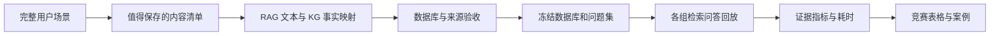

# MINDPET RAG 与 KG 检索消融实验方案

日期：2026 年 10 月 1 日

用途：AIC 人工智能算法精英赛项目的检索实验与答辩展示

源码依据：master，提交 `fc45a460c0916a370753487bfc34f873ebf19e86`

本次交付：实验方案。数据集、实验入口与结果文件为后续实现设计。

本实验先构建一份模拟真实保存状态的 SQLite 记忆数据库，包含 RAG 文本、KG 实体、显式关系和共同的来源证据。所有正式对照使用同一数据库快照和同一批问题，通过开关控制检索通道与排序方法。运行在返回支撑答案的文本或关系证据时结束，测量召回、排序、证据完整性与本地耗时。

数据库中的记录都是已经判定值得记住的内容。完整场景中可以存在未保存的闲聊、一次性请求和助手回应，但这些内容留在场景素材中，不导入待检索语料。同一段需要记住的用户对话可以同时形成 RAG 记录和 KG 关系；两种表示关联到同一来源，评价时同一事实只计一次。

竞赛主线是证明语义记忆与事实关系相互补充：RAG 找到描述、原因、偏好和事件背景，KG 找到明确的人物、项目、工具和组织关系，组合后更完整地支持问题。所有指标与提升目标由团队自定，并非 AIC 官方要求。数据中保留各基线擅长的问题和真实失败情况，最终以冻结测试集实测值填表。

## 1 第一步与实验边界

**第一项实际交付是构建并验收一份带来源和金标的 RAG 与 KG 数据库。** 建库前先定义场景、保存清单、实体关系和问题金标；直接把这份已经筛选好的内容入库。随后完成索引与向量生成并冻结快照，再让所有方法查询该快照。



这里的“检索问答”指给出自然语言问题，检查数据库中的必要证据是否找到、关系是否正确、排序是否合理；`expected_answer` 用于核对事实含义和完整证据集合。本次主实验不调用回答模型，因而不计算最终生成答案的准确率。将来若要展示生成回答，可另接固定 Reader 作演示，单独计时与报告。

测试问题不作为新对话写入数据库，运行期间也不新建事实、更新画像或调用馆长。数据保存判断、KG 提取和 RAG 写入已经由人工准备完成，这次评价的条件是“给定已保存记忆”，不据此宣称验证了自动保存能力。

## 2 源码里的 RAG 与 KG 如何配合

### 2.1 同一对话的两种保存表示

`KnowledgeGraphService.onCompletedTurn` 第 124 至 128 行先持久化提取出的实体、关系和证据，再在符合 RAG 保存条件时调用 `memoryService.appendTurn` 保存用户消息。`shouldPersistMemory` 的条件为 `shouldRemember=true`、`importance≥0.35`、`confidence≥0.45`。图谱持久化和 RAG 保存的具体条件并不完全相同。

因此不能假设全部对话都保存，也不能假设每条已保存文本都有图谱关系。主模拟集保留两种常见情况：只保存 RAG 的描述性记忆，以及同时保存 RAG 和 KG 的显式事实。若以后采用真实数据中的 KG 单独保存情况，需记录其实际保存依据；主集不为提高 KG 分数额外制造这类独占事实。

源码中的 `appendTurn` 保存的是选中回合的 `userMessage`。场景模拟保留该回合原文，一段话包含多项事实时可以是一条 RAG 记录、多个 KG 关系。原子事实拆分用于金标与证据评价，不据此把 RAG 改写成比原文更有利于检索的答案摘要。

### 2.2 三个被测检索组件

| 组件 | 入口与表 | 当前行为 |
| --- | --- | --- |
| RAG 原始记忆 | `SqliteMemoryService.search`；`long_term_memory` | 中文片段、余弦向量、RRF、创建时间与重要性等重排 |
| RAG 默认单元 | `MemoryCorpusCompactionService.searchUnits` 和 `searchWithFallback`；`memory_retrieval_unit` | 意图可见性、向量与片段召回、RRF、语义去重、意图加分、Token 预算与回退 |
| KG 事实检索 | `KnowledgeGraphService.getRagContext`；`kg_entity`、`kg_relation`、`kg_evidence` | 显式名字优先并补充实体向量匹配，邻居扩展，读取显式关系并输出事实 |

`AiService` 第 1379 至 1411 行先读取默认记忆上下文，必要时使用原始记忆；符合 `isRelationshipQuery` 时另外读取 KG 上下文。这证明现有程序已有 RAG 与 KG 并行辅助，但没有把 KG 作为第三路统一 RRF，也没有实现完整的 RAG 候选引导 KG、KG 关系再回取 RAG 的双向流程。

四组 RAG 排序消融与截图对应，首先测原始记忆模块；组合主实验加入 KG。当前默认 RAG 单元链路另用 `native-units` 配置核验，不能把原始记忆的多因素公式写成默认链路的排序公式。

### 2.3 KG 能力与限制按源码记录

现有 KG 入口以 `maxEntities=4` 为默认调用参数：先选种子，再一次扩展邻居，最后读取所选节点间的显式边。显式名字匹配最多先补三项；实体语义检索复用查询向量。关系输出最多八条，置信度小于 0.65 的关系不输出，还受实体与关系 retention 规则影响。

一次邻居扩展不等同于任意多跳路径搜索；多个种子有时可以覆盖两跳链，但不能宣称当前代码一定支持任意两跳或三跳。KG 的边按重要性与提及次数排序，也没有通用查询相关性重排。实体相似度或前端展示用的相似边不能当作真实事实边。

当前关系表没有通用 `valid_from`、`valid_to`、否定状态或别名表。场景先采用允许的实体类型与谓词，并在来源文本中保留日期、否定与计划条件。历史状态更新能力主要由 RAG 与已有单元字段核验；若增加图谱时间、别名或路径能力，标记为新增版本，不预设源码已有。

## 3 消融矩阵与实验顺序

### 3.1 保留四组 RAG 对照

| 组别 | 方法 | 候选与排序 | 验证内容 |
| --- | --- | --- | --- |
| A | Keyword | 中文片段前 L 条，按匹配分排序 | 精确词面基线 |
| B | Vector | 同用户向量前 L 条，按余弦距离排序 | 语义基线 |
| C | RAG RRF | A、B 候选并集，RRF 排序 | 词面与语义互补 |
| D | RAG RRF 加重排 | 与 C 完全相同的候选并集，源码多因素排序 | 重排增益 |

主配置 `L=20`，并集最多 40 条 RAG 记忆，保留前 10 条计算 K=1、3、5、10。同分以稳定 ID 排序。C、D 的候选 ID 集合逐问题相同，不能给 D 额外召回通道。

### 3.2 KG 与 RAG 协同是主实验的一部分

| 组别 | RAG | KG | 组合方式 | 必须比较 |
| --- | --- | --- | --- | --- |
| E | 关闭 | 开启 | 只返回 KG 显式事实 | 检查 KG 单独能够覆盖什么 |
| F | C | 开启 | 并行检索，共同证据预算 | F 对 C，验证未重排时的 KG 补充 |
| G | D | 开启 | 与 F 相同的 KG 和组合规则 | G 对 D 验证 KG；G 对 F 验证重排 |
| H | D | 开启 | RAG 与 KG 双向协同的拟新增适配 | H 对 G，验证引导检索本身 |

第一阶段最低交付包含 A 至 G。H 是第二阶段的明确优化方向，有实际实现后再填结果。F、G 构成“重排开关 × KG 开关”的对照，与 C、D 一起区分排序贡献和 KG 贡献。

A 至 G 使用同一快照、同一 user ID、同一查询文本与查询向量。主实验 E、F、G 对每题都执行同一个 KG 检索器，不根据题目分类或金标强行选择种子。这样测的是通道能力。另用生产 `isRelationshipQuery` 开关回放一次，记录实际是否触发 KG，核验产品中的路由覆盖率。

当前路由词包括“关系”“和谁”“一起”等，但“青禾项目采用什么数据库”不一定触发 KG。不能为了让生产路由看起来有效而只写带触发词的问题。扩大路由规则只能在开发集完成，并标记优化版本。

### 3.3 共同预算和组合规则

四组 RAG 的标准排序指标使用相同 K。跨 KG 与 RAG 比较时，不能把一段长文本、一条实体和一条边随意当作同一种“记忆条数”。组合主表使用共同的 **512 Token 证据预算**，RAG 预算从源码 `MemoryTokenCounter` 计算，KG 按实际序列化的事实文本计数。

F、G 先分别运行 RAG 和 KG，再采用相同的预算分配与交替装入规则：初始各 256 Token，按各通道顺序装入；每轮先一条 RAG、再一条 KG。超过剩余配额的项跳过，所有项处理后，未使用配额统一回填，按剩余 RAG 与 KG 顺序交替装入。正文、必要的事实标签和实际输出的来源标签均计入预算。D 或 E 单通道使用完整 512 Token。

这是实验适配的明确组合规则，源码现有上下文拼接没有统一 RAG 与 KG 总预算。它不宣称实现了三路 RRF；F、G 用同一规则，保证增益比较可解释。原生上下文另报告实际总 Token 和证据完整性。

两路文本与图谱都支持同一事实时，只增加一次事实覆盖，但仍按真实输出计 Token，重复内容不获得额外收益。不得用金标事实 ID 在检索或装入时去重。算法可用来源 ID、文本规范化等实际可获得信息；金标只在评价后使用。

KG 增加数据库操作和候选量，其资源差异公开记录。追加 C、D 的较大单路候选上限及相同总 Token 预算对照，检查组合优势是否仅来自更多候选；G 对 F 的候选和预算保持一致。

## 4 完整场景模拟与已保存数据

### 4.1 从场景事实到两种表示

每个用户先有一份一致的世界状态与时间线，再写多个会话。每条用户消息决定是否值得保存、保存 RAG 还是同时保存 KG，并注明原因；之后建立实体和关系，最后设计问题。不要从目标答案反向批量生成重复模板、把每个问题答案都写成一条高度匹配的记忆。

```text
场景与会话 turn_id
  ├─ 应保存的用户原文 → rag_memory_id
  ├─ 明确出现的实体 → entity_id
  ├─ 明确确认的事实 → relation_id → kg_evidence_id
  └─ 共同来源 → source_id 与 turn_hash

事实金标 fact_id → 支撑它的 RAG 片段或 KG 关系表示
问题 query_id → 必要 fact_id 集合与 expected_answer
```

`source_id`、`turn_id`、`fact_id` 是实验数据标识。`kg_evidence` 现有字段使用 `turn_hash` 和 `session_id`，并没有通用 `source_turn_id`；Importer 在独立来源映射文件中建立关联，不假装数据库已经有该字段。

`fact_id` 表示一个具体的可核查命题，例如“青禾项目 uses SQLite”。同一命题被重复提及、存入 RAG 或 KG 时可以有多个来源表示；这些事实映射仅由 Evaluator 使用，Retrieval Runner 不读取它或 qrels。一个回合可以支撑多条不同事实，不能按 turn ID 把它们全部合并成一条。

### 4.2 一套可贯穿所有类型的模拟场景

示例用户 U01 在“星桥实验室”参与“青禾项目”，与林舟、顾宁协作。两人负责不同项目并使用不同工具；多个会话逐步提供职责、工具、习惯、失败经验和计划。以下内容是拟构造样例，尚未导入数据库。

| 回合 | 已筛选的用户内容 | RAG | KG 显式关系 |
| --- | --- | --- | --- |
| T01 | 我在星桥实验室参与青禾项目，林舟也负责青禾项目。 | 保存整段 | User belongs_to 星桥实验室；User works_on 青禾；林舟 works_on 青禾 |
| T02 | 青禾项目使用 SQLite 保存数据，林舟平时用 DataGrip 管理这个库。 | 保存整段 | 青禾 uses SQLite；林舟 uses DataGrip |
| T03 | 我希望助手回答简短一些，先给结论；讲复杂概念时最好带一个具体例子。 | 保存整段 | 主集可仅 RAG，保留完整表达条件 |
| T04 | 顾宁负责白露项目，白露用 PostgreSQL，顾宁用 DBeaver 管理数据。 | 保存整段 | 顾宁 works_on 白露；白露 uses PostgreSQL；顾宁 uses DBeaver |
| T05 | 我认识林舟和顾宁；我当前只参与青禾，没有参与白露。 | 保存整段 | User knows 林舟；User knows 顾宁；已存在的 User works_on 青禾保留；否定部分不造肯定边 |
| T06 | 我参加的青禾项目上次汇报因为关系图文字太密、字号太小，后排看不清，后续汇报要先改这张图。 | 保存整段 | User experienced 青禾汇报事件；原因细节保留在 RAG |
| T07 | 我和林舟已约定参加青禾项目的阶段评审，评审事件定在 2026 年 9 月 28 日，材料需要准备检索案例。 | 保存整段 | User plans 青禾阶段评审；林舟 plans 青禾阶段评审；青禾 related_to 青禾阶段评审 |
| T08 | 青禾的阶段评审我参加过了，后来决定下一次展示优先介绍检索证据，再展示关系图。 | 保存整段 | User experienced 青禾阶段评审；历史计划来源保留，不伪造自动撤销字段 |
| T09 | 我平时阅读资料会用 Obsidian，主要为了整理项目笔记；写程序则用 IntelliJ IDEA。 | 保存整段 | User uses Obsidian；User uses IntelliJ IDEA；用途细节仍在 RAG |
| T10 | 青禾阶段评审属于星桥实验室内部的项目评审活动。 | 保存整段 | 青禾阶段评审 belongs_to 星桥实验室 |

完整场景还可以出现“你好”“把这句话润色一下”或助手建议。这些回合标为未保存，保留在 `scenario-turns.jsonl` 中，用于确认筛选边界，不能成为 RAG 行、KG 事实或假负例。

上述干扰项本身都是应保存的真实事项，例如白露项目和顾宁使用的工具。它们对“林舟用什么工具”是干扰，但对“顾宁用什么工具”是正确证据。无关闲聊不用于扩大记忆库。

KG 使用源码允许的谓词：`prefers`、`dislikes`、`uses`、`learns`、`builds`、`works_on`、`plans`、`knows`、`experienced`、`belongs_to`、`related_to`。不新增 `lives_in`、`managed_by` 等谓词来假装当前 schema 支持完整语义。细节不适合既有关系时保留 RAG；图中实体 summary 只含该实体实际已确认的介绍，不堆入邻居答案或测试问题。

### 4.3 同一场景里的互补问题

| 问题 | 需要的事实或内容 | 要观察的互补作用 |
| --- | --- | --- |
| 我希望你怎样解释比较难的概念？ | T03 中简短、先结论、具体例子的表达条件 | RAG 语义改写；不能因图里有 preference 节点就判完整命中 |
| 林舟平时用什么工具管理数据？ | 林舟 uses DataGrip | KG 明确人物与工具；RAG 原文同样有机会命中 |
| 我和林舟一起做的项目用什么数据库？ | User works_on 青禾；林舟 works_on 青禾；青禾 uses SQLite | 关系链的完整证据，防止仅找到 SQLite 关键词就计成功 |
| 我认识的两个人，各自负责哪个项目，用什么工具？ | T01、T02、T04、T05 的人、项目与工具关系 | 多个正确分支与对象对应；不能把顾宁工具错给林舟 |
| 我认识的林舟负责的项目，其阶段评审属于哪个组织的活动？ | User knows 林舟；林舟 works_on 青禾；青禾 related_to 评审；评审 belongs_to 星桥实验室 | 路径压力题，允许源码失败；多跳扩展单独优化 |
| 我之前那次项目展示为什么需要改关系图，是哪个项目？ | T06 的文字密、字号小、后排看不清；青禾事件关联 | RAG 描述原因，KG 辅助定位项目和事件 |
| 林舟用的是 DBeaver 吗？顾宁呢？ | 林舟 uses DataGrip；顾宁 uses DBeaver | 同场景近似事实与对比，保留 RAG 原文否定背景 |
| 9 月 28 日那次评审需要准备什么材料，后来我决定怎样展示？ | T07 日期与检索案例；T08 后续展示决定 | RAG 事件与历史内容，KG 事件定位；不要求无时间字段的边独自判当前状态 |
| 青禾项目采购了多少台服务器？ | 全部已保存内容没有该事实 | 无答案题，不能因为存在青禾节点就补答案 |

该场景同时有 RAG 擅长、KG 擅长、两者共同支持和两者都不足的查询。每个场景都按同样方式建立实体、关系、原文、时间线和问题，不能只单独生成一批三元组再配无关的 RAG 文本。

### 4.4 数据规模和来源比例

第一步先验收一个完整场景，建议 30 至 50 个应保存回合、15 至 30 个实体、25 至 50 条显式关系、20 至 30 个问题；规模是准备目标，不要求为了凑数虚构关系。确认 KG 与 RAG 来源映射和金标正确后，再扩展到正式集。

正式集目标为 16 个独立用户、2,000 个应保存用户回合、400 个问题，每用户约 125 回合、25 问。RAG 条数按实际保存回合计；KG 实体、关系和 evidence 行数单列，不把一段对话的多种表示相加当作“更多记忆”。建议约 60% 回合具有 RAG 与 KG 双表示，其余为描述性 RAG；这个比例用于保证场景覆盖，可随实际事实结构调整并如实记录。

四个用户的 100 问用于开发；十二个用户的 300 问用于测试。用户、实体、事件和问法模板族分离。测试约 270 问有答案、30 问无答案。

| 主类型 | 总数 | 开发 | 测试 |
| --- | ---: | ---: | ---: |
| 描述性语义与背景 | 80 | 20 | 60 |
| 人物项目工具单跳事实 | 64 | 16 | 48 |
| 两跳与分支关系证据 | 64 | 16 | 48 |
| RAG 与 KG 组合证据 | 64 | 16 | 48 |
| 当前历史与计划 | 48 | 12 | 36 |
| 专名数字与对象消歧 | 40 | 10 | 30 |
| 无答案与近似干扰 | 40 | 10 | 30 |
| 合计 | 400 | 100 | 300 |

每题同时可有多标签，如关系、语义改写、历史。每个用户的子图彼此隔离，但可以出现相同名字，检查跨用户泄漏；同用户同名不同人使用有原文依据的规范名区分，因为当前唯一约束按用户、规范名、类型合并。

主查询范围是所属用户约 125 个保存回合与其 KG 子图，不能把全库 2,000 回合写成每个问题的检索规模。单用户 1,000、3,000 条规模实验追加其他值得记住的事件和配套实体关系，不用闲聊填库。

## 5 数据生成的精确约束与金标

### 5.1 准确生成与保存状态

优先采用脱敏真实场景，或先人工设计一致的事实清单再模拟会话。如用模型辅助起草，固定场景世界状态、实体表、时间线与 JSON schema，逐回合生成后人工复核；生成和检查的成本不进入检索耗时。

保存清单在问题金标之前决定。每条记录有 `store_rag`、`store_kg`、`save_reason` 与明确来源；重复提及影响实际 mention_count，而不是为了排序得分直接手填高次数。重要性依据长期价值，置信度依据用户确认程度，在不看测试 qrels 的情况下标注。

实体名称、关系方向、谓词、日期、计划或已发生状态必须一致。一条 KG 边至少有一段明确用户证据；助手猜测不作关系依据。“没有参加白露”不能变成 User works_on 白露；“计划参加”用 plans，“已经参加”用 experienced，不把两种状态混为一个肯定事实。

同一边多次确认只存一个 relation ID，并挂多个 evidence；重复提及按源码规则聚合重要性与置信度。重复来源不会在评价中变成多个独立事实。事件日期与提及时间分开，主快照 T0 之后的内容不得出现在语料中。

### 5.2 数据文件与映射

| 文件 | 关键字段与作用 |
| --- | --- |
| `scenarios.jsonl` | user_id、scenario_id、实体清单、世界状态、时间线 |
| `scenario-turns.jsonl` | turn_id、source_id、session_id、occurred_at、user_message、assistant_message、保存标记与原因；完整场景素材 |
| `rag-memories.jsonl` | rag_memory_id、db_id、source_id、原文、importance、confidence、layer、时间、可见性；只含已选中回合 |
| `kg-entities.jsonl` | entity_id、user_id、normalized_name、display_name、type、summary、mention 与时间 |
| `kg-relations.jsonl` | relation_id、两端 entity_id、predicate、confidence、importance、mention 与时间 |
| `kg-evidence.jsonl` | evidence_id、relation_id 或 entity_id、turn_hash、source_id、session_id、实际用户来源文本 |
| `source-map.jsonl` | source_id、turn_id、rag_memory_id、kg_evidence_id；Importer 与来源追溯使用 |
| `facts.jsonl` | fact_id、具体命题、来源与各表示的实际支持片段；仅 Evaluator 使用 |
| `queries.jsonl` | query_id、user_id、query、query_time；供 Runner 读取的问题输入 |
| `query-gold.jsonl` | query_id、split、类型、expected_answer、has_answer、必要事实与可替代证据集合；仅 Evaluator 使用 |
| `qrels-rag.jsonl` | query_id、rag_memory_id、0 至 3 相关性等级；仅用于 RAG 排序表 |
| `qrels-kg.jsonl` | query_id、relation_id、0 至 3 相关性等级、必要路径与实体；仅用于 KG 专项 |
| `manifest.json` | 数量、保存与重叠比例、版本、来源类别、标注版本、文件哈希 |

数据库存保存内容与来源，不存测试问题和金标答案。完整场景素材、facts、query-gold 和 qrels 留在评价文件中。检索阶段不能利用题型标签、expected_answer、gold entity、gold relation 或 gold path。

### 5.3 共同事实金标与双表示计分

每题先给出事实命题和可完成支撑的最小集合，再标各 RAG 原文、KG 边的支持关系。允许一条 RAG 原文支持多个事实，也允许多个表示支持同一事实。两名标注者独立检查，争议复核后冻结；对所属用户所有可检索记录检查，不能只标某算法返回的候选。

相关性等级为 3 直接支持答案、2 必要支撑、1 有关背景、0 无关或对象时间错误。RAG 与 KG 的标准 Recall 分别按各自金标表示计算；两者协同用共同 fact_id 评价覆盖。

**KG 仅返回关系时，只计这条实际呈现的关系所支持的事实。** 不能因为 `kg_evidence` 关联到 T02，就把 T02 中没有呈现的所有细节都算作 KG 已召回。若 H 实际又取回 T02 原文，才可评价原文中的其他事实，同时计入其 Token 与耗时。KG-only 可以返回关系来源 ID 和短引文以追溯，但不能借此隐藏返回整段 RAG 文本。

同样，命中一个实体名称不能算命中了与其相关的全部关系；只找到青禾或 SQLite 不等于完整支撑“我与林舟共同参与的项目用什么数据库”。路径题必须有正确节点、方向与每条必要边，完整支撑还要满足对象和时间条件。

## 6 直接构建数据库

### 6.1 一份数据库包含两套表示

文档继续放在 master；后续实现与数据库位于 `D:\youkeda\MINDPET-retrieval-ablation` 的 `codex/retrieval-ablation` 分支。拟定数据库路径：

```text
D:\youkeda\MINDPET-retrieval-ablation\docs\experiments\retrieval-ablation\runtime\corpus.db
```

使用项目 `db/sqlite-schema.sql` 与 `SqliteStorageConfig` 的幂等迁移初始化，显式传入独立路径。Importer 先装实体，再装关系和来源，再装 RAG 与来源映射；可以分批事务，最终全部验收通过才冻结。A 至 H 共用这份库；关闭 KG 只是关闭查询，不能删图或另换更弱数据库。

| 数据库表 | 导入内容 |
| --- | --- |
| `long_term_memory` | 已保存用户回合原文、向量、重要性、置信度、层级、时间等 |
| `kg_entity` | 允许类型的实体、原文支持的 summary 和实体向量 |
| `kg_relation` | 允许谓词的有向显式事实及元数据 |
| `kg_evidence` | 每个实体或关系的真实来源回合，turn_hash、session_id 与用户文本 |
| `kg_turn_ingest` | 已导入图谱回合及真实实体关系数，不计作可检索知识 |
| `memory_retrieval_unit` 与 `memory_retrieval_source` | 默认单元核验时使用的相同已保存 RAG 内容和来源映射，准备阶段完成 |

主集 RAG 必须与 scenario-turns 中选中的用户原文一致。同一回合生成的图谱事实可分多条，但不能把 KG-only 的时间、细节补全成用户从未说过的新事实。

### 6.2 直接入库而不回放写入系统

RAG 用参数化 INSERT 显式写入 `id,user_id,session_id,content,role,embedding,importance,confidence,layer,emotion,searchable,created_at,last_accessed,access_count,event_date,event_at,event_timezone,event_precision`。`layer` 依源码分配，重要层为 2，常规层为 3。`access_count` 与时间使用准备好的固定值。

不调用 `appendTurn`、`onCompletedTurn` 或馆长回放导入：它们涉及再次判断、生成向量、时间解释、异步提取和可能清理，会改变预先确认的语料。RAG 与 KG 都由 Importer 直接插入，并生成表 ID 到来源 ID 的可核对映射。

RAG 文本和非 User 实体的向量使用相同 provider、模型与维度；实体输入沿用源码的 `name + summary` 方式，User 节点不造高信息量向量。所有查询向量一次性生成缓存，固定 provider，禁止轮中 AUTO 切换或静默空向量。BLOB 使用 `VectorSearchService.encode` 的 little-endian float32 编码。

数据库需检查用户一致性、外键、唯一约束、所有 KG 边的来源、正确方向、重复合并、RAG 原文一致、向量维度、时间范围与全部金标引用。KG entity-only evidence 和 relation evidence 区分，别把同一次提取的证据行数当作独立事实数。

### 6.3 固定时间与冻结快照

场景使用真实一致的时间线，不把全部长期经历压到最后 24 小时来迎合排序。固定 `T0`，区分 occurred_at、created_at、last_accessed、first_seen 与 last_seen。若另做“历史资料在 T0 一次性导入”的场景，明确记录导入时刻和事件时刻的差异，单独报告。

主配置 `core-selected` 给所有方法统一使用已保存且 searchable 的语料，关闭随 wall clock 衰减造成的资格剔除，保留 D 的时间重排。这样测给定已保存记忆的检索核心；这是明确的实验适配，不能称原生过滤完全不变。`native` 配置保留源码各路 retention，报告老但应保存内容的遗漏，金标分母不因此缩小。

RAG 的 Java 时间与 KG SQL 的 `julianday('now')` 都要参数化到同一固定时钟；只冻结 Java Clock 不能固定图谱查询。关闭访问与 mention 写回，索引迁移准备在计时前完成。要保留原生写回行为时，每题恢复独立副本或使用隔离事务回滚，避免顺序影响。

提交全部事务、WAL checkpoint 后冻结库和哈希；所有方法读取相同快照，测试运行前后核对数据内容未改变。查询、指标与结果写到文件，完整场景素材不被 Runner 当作备用知识。

## 7 实验适配与双向协同

### 7.1 RAG 算法按实际执行公式

关键词使用小写内容与查询，整句包含得分 0.8，否则统计 2 至 4 字符片段，`min(0.6,hits×0.15)`；名称为 Keyword，不称 BM25。源码原生先取重要性最高 100 条，主配置扫描完整同用户已保存集合后取 L，原生截断另核验。

向量使用余弦距离；sqlite-vec 距离计算和 Java 精确回退单独配置。当前 SQL 按行算距离再排序，不能声称已有 ANN。RRF 的常数为 60，排名从 1 开始。

```text
rrf(m) = Σ route 1 / (60 + rank_route(m))
hours = (T0 - created_at) / 3_600_000
strength = importance >= 0.6 ? 5.0 : 1.0
time_decay = exp(-hours / (strength × 24 + 1))
score_D = 0.5 × rrf + 0.2 × time_decay + 0.2 × importance
        + 0.05 × confidence + (importance >= 0.6 ? 0.05 : 0)
```

该公式不直接使用情感，也不使用事件日期；附近注释与公式不一致时以公式为准。默认单元链路另外使用 RRF 与 `intentBoost`，不套此公式。

### 7.2 KG 适配返回结构化证据

新增仅供实验调用的 `retrieveFacts(userId,query,queryVector,config)`，复用源码种子、邻居和显式边行为，返回 entity_id、relation_id、evidence_id、来源、置信度、各阶段排名和时间。该接口为拟新增，不能直接用 `getRagContext` 的字符串猜回图 ID。

原生配置保留最大种子数、一次扩展、0.65 置信度、八条关系和排序规则，增加稳定 ID 同分排序。图谱无事实是正常空列表；数据库错误或向量异常单独报 error。纯事实检索不触发 `extract` 或生成新的边。

### 7.3 双向协同版本 H

H 使用 G 的初始 RAG、KG 候选与同一 512 Token 输出预算，增加两项有界操作。

1. **RAG 引导 KG。** 初始 RAG 前五个回合，经 source-map 找到该回合已有 KG 实体与关系；把实际映射到的实体加入种子并按配置继续扩展，帮助口语查询定位没有直接提到名字的对象。未找到来源映射时可明确无映射，不能用 gold entity 填补。
2. **KG 回取 RAG。** 对实际召回的关系，经 kg_evidence 和 source-map 找回原始保存回合，补充背景、原因、时间与限定条件；将其纳入 RAG 候选，按同一 RAG 排序规则重排，再装入预算。

限制每题 RAG 引导种子最多 10 个、探索总边最多 80 条、扩展深度最多两跳、回取原文最多 20 条。参数先在开发集定；记录实际访问量与耗时。若增加三跳，用独立配置标记，不把它归功于原生一次扩展。

这里读 source-map 的来源关联属于实际可获得信息；读取 facts 或 qrels 选种子属于金标泄漏。H 的候选可比 G 多，因此另比较增大 G 初始候选预算的版本，并展示候选量和图访问量。

追加 H 去掉 RAG 引导 KG、H 去掉 KG 回取 RAG 两组，分别解释两个方向的贡献。KG 回取原文属于联合检索，在 E 的 KG-only 中关闭。

### 7.4 默认产品行为核验

`native-units` 一对一装载已保存 RAG 原文到单元表、保留可见性和来源，禁止馆长生成额外语料；检索参数复用源码 `L=40`、关键词预扫 300、词面门槛 0.25、向量距离门槛 0.65、512 Token 与意图加分。

其相同 RAG 开关与 KG 开关按 A 至 G 结构重新回放，主表注明使用哪条 RAG 链路。实际生产还原需保留关系词路由并报告未触发题目。最后用于演示的程序 commit、路由与协同版本必须对应实验表；当前单元检索与优化双向协同的结果分开命名。

## 8 指标与性能

### 8.1 RAG 排序主表

有答案问题 q 的相关 RAG 集合为 `R_q={relevance≥2}`，前 K 条去重 ID 为 `T_q,K`。先算每题值，再对问题宏平均；辅以用户宏平均和分类型结果。

| 指标 | 定义 |
| --- | --- |
| Recall@K | `|T_q,K ∩ R_q| / |R_q|` |
| Precision@K | `|T_q,K ∩ R_q| / K`，不足 K 条分母仍为 K |
| MRR@10 | 前十条首个等级至少 2 的排名倒数，未命中为 0 |
| nDCG@K | gain=`2^grade−1`，第 r 位折损=`log2(r+1)`，除以 IDCG |
| Hit@K | 至少命中一条等级至少 2 的问题比例 |
| CandidateRecall | 全部候选的相关记忆数 / 全部相关记忆数 |

RAG 排序主指标为 Recall@5 与 nDCG@5，截图主表配套 Precision@5 与 MRR@10。原参考材料把至少命中一条称为 Recall，本方案使用标准分母，将其单列为 Hit。C、D CandidateRecall 应相同。

### 8.2 KG 与联合检索主表

设问题需要的事实集合为 `F_q`，方法在实际输出预算 B 内提供的可支持事实集合为 `S_q,B`。同一事实的 RAG 与 KG 双表示合并一次。所有方法评价同一事实全集，不能因某组没开 KG 就删掉关系金标。

| 指标 | 定义与适用范围 |
| --- | --- |
| EvidenceCoverage@B | `|S_q,B ∩ F_q| / |F_q|`，主 B=512 Token；比较 D、E、F、G、H |
| CompleteSupport@B | 输出完整包含任一可完成答案的最小事实集合的比例 |
| KG EdgeRecall@8 | 前八条事实边中的相关边 / 全部相关边；仅在有图谱事实金标的题上算 |
| PathComplete@B | 必要路径中节点、方向、每条事实均被输出，满足对象条件；单列关系路径题 |
| KG marginal coverage | `coverage_G−coverage_D` 的逐题差值；可正可负 |
| RAG marginal coverage | `coverage_G−coverage_E` 的逐题差值；可正可负 |
| Redundancy@B | 重复支持既已呈现事实的证据 Token / 总输出证据 Token，按固定标注规则统计 |
| Conflict rate | 输出中被标为对象、否定、时间或状态冲突的项比例，分类型报告 |

跨通道指标命名为证据覆盖与完整支持，不能把 KG 节点数加到 RAG Recall 分子。联合表的路径完整率允许每条事实由实际返回的 RAG 原文或 KG 显式边支持，不要求 RAG-only 输出图结构。完整路径是召回证据完整性，并非模型推理准确率。G 的新增事实和同预算挤出的 RAG 事实都展示，不能仅统计 KG 的正收益。

KG 与 RAG 重复命中同一事实可能帮助定位与追溯，但覆盖率只算一次。前后是否减少 Token 重复由 Redundancy 检查，不能事后以 gold fact 去重后虚报输出成本。

### 8.3 无答案问题

无答案题与质量主平均分开，报告空返回率、返回条数、无依据关系数及最高分分布。命中实体而没有答案事实不算成功。现有 RRF 与 KG importance 分数不等于回答置信度；空返回阈值若新增，只能在开发集选择后冻结。

`expected_answer` 为 unknown 的题不参与 Recall 的零分母运算。本次不称“模型拒答准确率”，也不让回答模型靠常识补全库外事实。

### 8.4 计时边界

核心计时从已经有查询向量的 query 与 user ID 输入，到实际预算内证据列表返回。包括 RAG 候选查询、实体检索、邻居扩展、关系及来源读取、H 的回取、过滤、去重、融合、重排和预算装入；不含建库、模型 Embedding、数据文件输出与指标计算。

单独记录 `rag_keyword_ms`、`rag_vector_ms`、`kg_seed_ms`、`kg_expand_ms`、`kg_edge_ms`、`source_fetch_ms`、`fusion_rerank_ms`、`budget_ms` 与总时长，阶段不重叠。每组必须真实执行所需数据库操作，不能共用一次候选查询的耗时作为所有组性能。

同机单线程、相同连接池和 backend，非测试题预热 30 次，五轮随机化问题与方法顺序，报告每轮 warm p50、p95 与范围。p95 来自逐次观测，不取每题平均后计算。质量问题只统计一次，性能重复不扩大质量样本量。

sqlite-vec 和 Java fallback 各自独立运行，记录实际扩展版本、SQLite、Java、CPU、内存、数据库和索引大小。轮中切换 backend 应记录并重跑固定 backend 结果。冷启动与含 Embedding 的耗时另外报告。

## 9 调参目标与结论

先保留 `source` 版本，即现有 RAG 权重、现有 KG 行为与明确组合预算。再在开发集优化 `tuned` 版本。原始 RRF 最高约 2/61，乘 0.5 后约 0.0164；时间项与重要性项各最高 0.2，可能压过相关性，需从真实失败例检查。

可以在开发集调整归一化、重排权重、KG 候选排序、路由、预算比例和 H 的扩展参数，但每次版本明确，选择规则在看测试结果前确定。冻结测试不修改金标、问题类型配比或最有利的指标。

竞赛内部建议以 G 相对 D 的 EvidenceCoverage@512 或 CompleteSupport@512 提升至少 5 个百分点作为开发目标，并检查 G 相对 E 的语义背景优势；D 相对 C 的排序收益单独报告。主指标未提升时照实分析，不承诺联合方法所有题型都更好。

按十二个测试用户做配对 cluster bootstrap，重采样 10,000 次，报告 95% 区间、绝对值、百分点差和样本量。问题属于同一用户时不当作全部独立样本。若区间宽，再补更多独立场景并保留原测试版结果。

因素附表包括 RAG 去掉时间、重要性、置信度等项，以及 H 的两个方向消融。没有执行的优化或模块不得填写成绩。

## 10 模块与执行顺序

| 模块 | 输入与输出 | 职责 |
| --- | --- | --- |
| ScenarioBuilder | 世界状态、会话、保存清单、两种表示、来源映射 | 生成可核查场景，区分保存与未保存 |
| DatabaseImporter | RAG、KG、来源与向量 → SQLite 与验收清单 | 直接入库，检查 schema、映射与数据一致性 |
| RetrievalRunner | 冻结数据库、查询与配置 → A 至 H 轨迹 | 只检索，不读取金标、不生成事实 |
| Evaluator | 轨迹、表示金标与事实金标 → 逐题与汇总指标 | 双表示不重复计事实，计算证据与耗时 |
| Reporter | 指标、证据 → 主表、分类型图与成功失败例 | 生成竞赛数字和可解释案例 |

实施顺序如下。

1. 先做一个完整开发场景，确认哪些回合应保存、哪些事实进入 KG、与 RAG 原文如何关联，并完成二十至三十个问题的金标。
2. 构建数据库并做数据验收，记录 RAG 回合数、实体数、关系数、双表示比例、来源覆盖与金标引用；通过后冻结第一版。
3. 用小场景跑通 A 至 G 的模块化检索，确认 KG 事实与 RAG 来源正确、没有重复虚增、没有读金标或写回数据库。
4. 扩展开发场景，开发参数与 H 协同，冻结配置；再按既定规则构建测试用户和快照。
5. 所有组检索同一测试快照，完成质量回放与五轮性能回放；跑原生路由与默认 RAG 单元核验。
6. 导出竞赛表格、每类效果、证据路径和失败案例，核对演示程序 commit 与报告版本。

数据库第一版验收必须满足：待检索行都在保存清单内；RAG 等于保存原文；每条 KG 边有用户证据；关系端点与 user ID 一致；同回合的 RAG 与 KG 可追溯；没有伪造别名和否定边；全部金标可定位到真实内容；问题与答案不在知识表内。

正式运行验收必须满足：各组数据库哈希与问题集一致；C、D 候选一致；F、G KG 输出与组合规则一致；指标按实际提供的证据计算；向量与 backend 固定；查询没有进入记忆；错误被明确保留。修复错误生成新的 run ID，不静默丢弃不利问题。

第一步属于数据构建与验收，本次仅修改方案，并未生成场景数据或创建实验数据库。

## 11 竞赛交付与展示

### 11.1 RAG 排序表

| 方法 | Recall@5 | Precision@5 | MRR@10 | nDCG@5 | p95 ms |
| --- | --- | --- | --- | --- | --- |
| A Keyword | 待实测 | 待实测 | 待实测 | 待实测 | 待实测 |
| B Vector | 待实测 | 待实测 | 待实测 | 待实测 | 待实测 |
| C RAG RRF | 待实测 | 待实测 | 待实测 | 待实测 | 待实测 |
| D RAG 重排 | 待实测 | 待实测 | 待实测 | 待实测 | 待实测 |

### 11.2 RAG 与 KG 协同主表

| 方法 | EvidenceCoverage 512 | CompleteSupport 512 | 路径完整率 | 输出 Token | p95 ms |
| --- | --- | --- | --- | --- | --- |
| C RAG RRF | 待实测 | 待实测 | 待实测 | 待实测 | 待实测 |
| D RAG 重排 | 待实测 | 待实测 | 待实测 | 待实测 | 待实测 |
| E KG-only | 待实测 | 待实测 | 待实测 | 待实测 | 待实测 |
| F RAG RRF 与 KG | 待实测 | 待实测 | 待实测 | 待实测 | 待实测 |
| G RAG 重排与 KG | 待实测 | 待实测 | 待实测 | 待实测 | 待实测 |
| H 双向协同 如实施 | 待实测 | 待实测 | 待实测 | 待实测 | 待实测 |

表注写清有答案题数、关系题数、数据库保存回合数及 KG 规模、RAG 链路、预算、路由、源码和适配版本。未执行 H 时不展示成绩行。KG 节点多不等于检索好；图谱可视化以真实召回的边和来源为依据。

展示同一完整场景里的三种案例：语义描述由 RAG 补充；对象和关系链由 KG 补充；共同检索找到关系并回取原文原因。展示问题、必要事实、各组实际文本、路径、来源回合及 Token。并保留至少十个成功和十个失败案例，包括错实体、漏边、多跳不完整、未触发 KG、元数据压低答案和重复占预算。

答辩结论采用实测填空：在同一已保存记忆数据库和同一测试问题上，联合检索相对 RAG-only 的证据覆盖由〔值〕变为〔值〕，相对 KG-only 补回了〔类型〕内容；完整支持率差值为〔值与区间〕，本地 p95 为〔毫秒〕。这些数字证明检索互补性，不替代写入判断或最终回答评价。

后续建议文件结构：

```text
docs/experiments/retrieval-ablation/
  data/<version>/
    scenarios.jsonl
    scenario-turns.jsonl
    rag-memories.jsonl
    kg-entities.jsonl
    kg-relations.jsonl
    kg-evidence.jsonl
    source-map.jsonl
    facts.jsonl
    queries.jsonl
    query-gold.jsonl
    qrels-rag.jsonl
    qrels-kg.jsonl
    manifest.json
  configs/
    core-selected.json
    native-raw.json
    native-units.json
    cooperative.json
  runtime/corpus.db
  results/<run-id>/
    run-config.json
    import-manifest.json
    query-results.jsonl
    metrics-by-query.jsonl
    metrics-summary.json
    rag-comparison.csv
    joint-comparison.csv
    cases.jsonl
```

逐查询轨迹包括各路候选 ID、种子匹配来源、展开深度、实际边、来源回合、过滤原因、排名、各项分数、最终输出、Token、计时、路由触发与错误状态。配置保存 commit、适配版本、快照哈希、Embedding、阈值、时钟、预算、扩展限制和随机种子。

## 12 材料与源码依据

1. `agent-memory-literature-and-baselines(1).docx`：采用写入、检索、阅读分层，公开指标不可直接横比的原则；论文成绩不作为本次实测基线。
2. `memory-retrieval-accuracy-experiment-revised.docx`：采用三路证据、关系与时间标注、必要证据集合与来源追溯；此次主实验已纳入 KG。
3. 用户截图：保留 Keyword、Vector、RRF、重排的四组表，并增补联合检索主表。
4. `MindPet-java/src/main/java/service/KnowledgeGraphService.java`：第 124 至 128 行两种保存，第 205 至 230 行图上下文，第 312 至 407 行事实来源，第 431 至 546 行种子、扩展与显式边，第 659 至 672 行 SQL retention，第 696 至 697 行 RAG 保存条件。
5. `MindPet-java/src/main/java/service/SqliteMemoryService.java`：第 111 至 218 行候选、RRF 与重排，访问写回和 retention 另作实验适配。
6. `MindPet-java/src/main/java/service/VectorSearchService.java`：余弦、sqlite-vec 与 Java fallback、BLOB 编解码。
7. `MindPet-java/src/main/java/service/MemoryCorpusCompactionService.java`：第 688 至 763 行默认单元检索，第 794 至 826 行回退，第 1292 至 1300 行意图加分。
8. `MindPet-java/src/main/java/service/AiService.java`：第 1379 至 1411 行 RAG 与 KG 调用，第 1432 至 1440 行关系问题路由。
9. `MindPet-java/src/main/java/config/SqliteStorageConfig.java`、`MindPet-java/src/main/resources/db/sqlite-schema.sql`、`MindPet-java/src/main/java/service/MemoryLayer.java`：表结构、迁移、字段与层级。

后续更改源码时更新 commit，并重新核对算法、路由、字段与引用行号。
